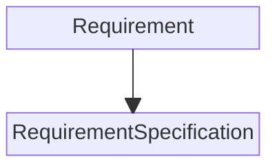

# Spector - Software Architecture

<https://share.google/aimode/85rXal2yiYofLAvB9>

- Model - where data is kept
- View ~ Presentation Layer - QT components (windows, widgets, etc.) + presentation logic (including receiving User input)
- Controller ~ Services - business logic

## Spector Layers



### Model

This is a layer where you keep your data.

We keep here only data that hold business value. It should be independent from particular application it is used in. We think here in categories of the Spector engine that can be used in many apps.

In Spector app we define here the basic data types:

- Requirement
- RequirementSpecification

```python
@dataclass
class Requirement:
    label: str
    description: str

@dataclass
class RequirementSpecification:
    title: str
    author: str
    version: str
    creation_date: datetime
    last_modification_date: datetime
```
